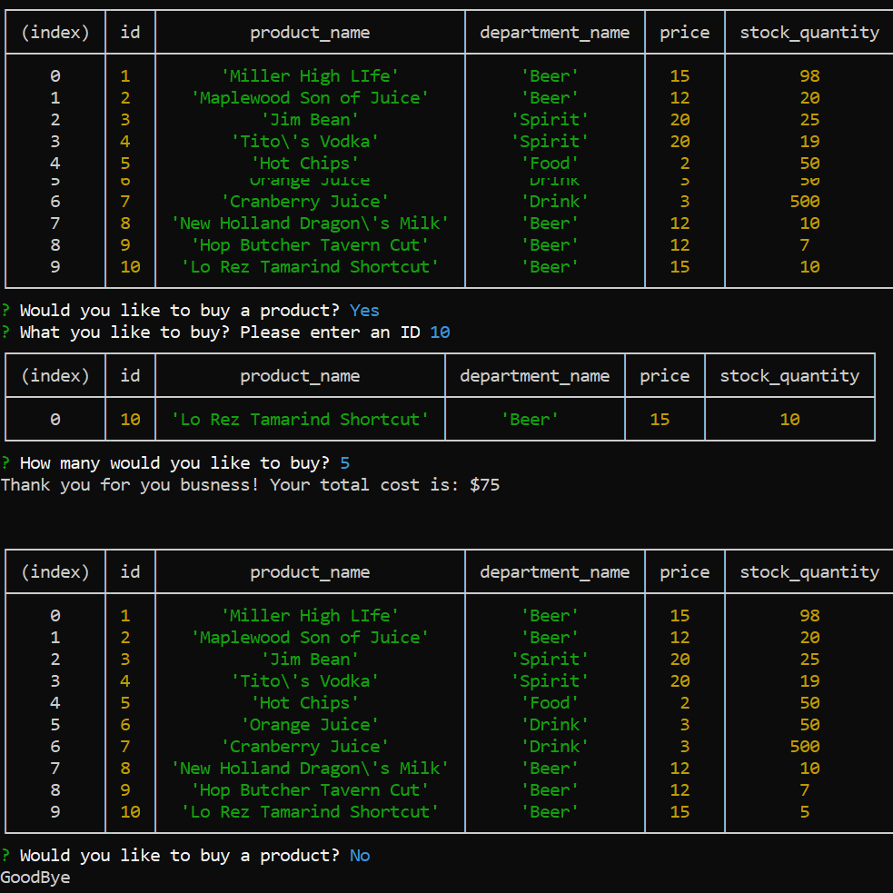

## bamazon
Bamazon is CLI node.js app using mysql to ineract with the inventory of a mock store

## Install in the app
1. if you have node.js installed then simple type 'npm install' into your CLI. This will install the necessary dependencies.

## Using the app
1. After running the app the user will be prompted on how to interact with the database
